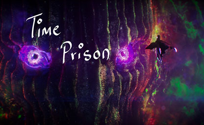

<!-- Improved compatibility of back to top link: See: https://github.com/othneildrew/Best-README-Template/pull/73 -->

<!--
*** Thanks for checking out the Best-README-Template. If you have a suggestion
*** that would make this better, please fork the repo and create a pull request
*** or simply open an issue with the tag "enhancement".
*** Don't forget to give the project a star!
*** Thanks again! Now go create something AMAZING! :D
-->

<!-- PROJECT SHIELDS -->
<!--
*** I'm using markdown "reference style" links for readability.
*** Reference links are enclosed in brackets [ ] instead of parentheses ( ).
*** See the bottom of this document for the declaration of the reference variables
*** for contributors-url, forks-url, etc. This is an optional, concise syntax you may use.
*** https://www.markdownguide.org/basic-syntax/#reference-style-links
-->

    

<!-- PROJECT LOGO -->
 

  <h3 align="center">Time Prison</h3>
  

    A 2D mystical platformer where players are trying to escape a labyrinth. The game's physics are intentionally deceptive, requiring players to fail and learn from their mistakes to progress through the levels. The level design focuses on teaching players through frustration, with obstacles designed to deceive and surprise players with increasing difficulty.
     
    

    <a href="https://www.youtube.com/embed/v66KK5Khpic" target="_blank">Trailer</a>
    

  

<!-- TABLE OF CONTENTS -->

  
Table of Contents

  <ol>
    <li>
      <a href="#about-the-project">About The Project</a>
      <ul>
        <li><a href="#built-with">Built With</a></li>
      </ul>
    </li>
    <li>
      <a href="#getting-started">Getting Started</a>
      <ul>
        <li><a href="#prerequisites">Prerequisites</a></li>
        <li><a href="#installation">Installation</a></li>
      </ul>
    </li>
    <li><a href="#contact">Contact</a></li>
    <li><a href="#acknowledgments">Acknowledgments</a></li>
  </ol>

<!-- ABOUT THE PROJECT -->
## About The Project

The gameplay of Time Prison is based on trial and error, where the player needs to fail multiple times to understand the twisted physics and escape the labyrinth. The game has three checkpoints, and the obstacles have been designed to deceive the player based on their prior knowledge of 2D platformers. The obstacles are placed in such a way that the difficulty level increases as the player progresses, and they are challenged throughout the course of the game.

The level design of Time Prison is made in a way to teach the players something they can use in the next try. The obstacles have been designed to surprise and possibly frustrate the player. Each obstacle is designed in such a way that the player is deceived by looking at the obstacle, even though they have surpassed a few obstacles. The obstacles have been placed in a way that the player's knowledge of the previous obstacle is taken into consideration, and they are deceived based on that knowledge. The level design is meant to increase the difficulty level as the player progresses and provide a challenging experience.

Project Goal: The goal of Time Prison is to create a 2D mystical platformer game with deceptive physics and challenging obstacles. The game is designed to provide a fun and engaging experience to the players and increase the difficulty level as the player progresses.

### Built With

Major frameworks/libraries used to bootstrap the project.

* Unity 2021.7

### Prerequisites

* Windows 10+
* Unity 2021+

### Installation

1. Clone the repo

2. Open Project in Unity

3. Play the Project inside Unity or Make a Build

<!-- CONTACT -->
## Contact

* Kalpan Agrawal - agrawal.k@northeastern.edu
* [![LinkedIn][linkedin-shield]][linkedin-url]
* [![Portfolio][portfolioIcon-url]][portfolio-url]

<!-- MARKDOWN LINKS & IMAGES -->
<!-- https://www.markdownguide.org/basic-syntax/#reference-style-links -->
[linkedin-shield]: https://img.shields.io/badge/-LinkedIn-black.svg?style=for-the-badge&logo=linkedin&colorB=555
[linkedin-url]: https://www.linkedin.com/in/kp-ag/
[portfolioIcon-url]: https://img.shields.io/badge/-Portfolio-brightgreen
[portfolio-url]: https://kalpan-ag.github.io/

